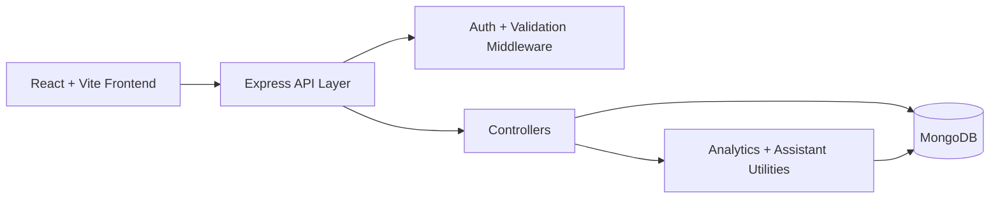

# MERN Expense Tracker

A production-ready MERN expense tracker built to showcase full-stack engineering, scalable API design, analytics thinking, and product polish.

## Why this project stands out

- JWT authentication with protected APIs and centralized error handling
- Expense CRUD with pagination, filtering, sorting, search, and user isolation
- MongoDB aggregation for monthly summaries, category breakdowns, and advanced analytics
- SaaS-style dashboard features: forecasting, anomaly alerts, recurring payment detection, spend health scoring, and suggested budgets
- Differentiators: scenario planner, savings goals, subscription-style bill reminders, AI-style assistant with free Ollama support and local fallback
- Trust and product maturity features: dedicated assistant workspace, activity timeline, and audit-style visibility across major user actions
- User-managed settings, richer transaction metadata, and sample-data onboarding for demo readiness

## Architecture



### Backend

- `backend/src/config`
  Environment loading and database setup
- `backend/src/models`
  Mongoose models for `User`, `Expense`, and `Goal`
- `backend/src/controllers`
  Route handlers for auth, expenses, goals, and assistant features
- `backend/src/routes`
  Express route registration with middleware composition
- `backend/src/middleware`
  Auth protection, validation handling, not-found, and global error formatting
- `backend/src/utils`
  Shared analytics, query helpers, async wrappers, and token utilities
- `backend/src/validators`
  Input validation with `express-validator`

### Frontend

- `frontend/src/context`
  `AuthContext` and `ExpenseContext` for app-wide state
- `frontend/src/pages`
  Dashboard, auth screens, and settings page
- `frontend/src/components`
  Product UI split into charts, expense modules, and shared components
- `frontend/src/api`
  Axios client with auth interceptor support
- `frontend/src/styles`
  Central visual system and responsive layout styles

## Key engineering decisions

- MVC backend structure keeps route, business, and data concerns separated
- Aggregation-heavy analytics are centralized in one utility to avoid duplicate logic
- Assistant responses degrade gracefully from Ollama to built-in logic
- Context + reducer keeps frontend complexity manageable without introducing heavy state libraries
- Analytics and product widgets are shaped from a single backend summary contract, which reduces UI inconsistency

## Features

### Core finance tracking

- Register, login, and protected session-based access with JWT
- Create, edit, delete, paginate, sort, and search transactions
- Export filtered transaction history as CSV
- Rich expense metadata: merchant, payment method, and notes

### Analytics and intelligence

- Monthly expense totals and category breakdown
- Income vs expense balance view
- Spend health score
- Month-end forecast and projected balance
- Anomaly detection for unusual expenses
- Recurring payment detection with next expected date
- Suggested monthly budget and top-category watchlist

### Product differentiators

- Scenario planner for “what-if” cost reductions or increases
- Savings goals with progress and required monthly savings
- Smart assistant panel using free Ollama when available
- Dedicated assistant chatbot section with multi-turn context
- Built-in assistant fallback when local AI is unavailable
- Activity timeline for audit-style product visibility
- Sample-data onboarding to demo the product instantly

## Local development

### Backend

1. Copy `backend/.env.example` to `backend/.env`
2. Set your MongoDB connection string and JWT secret
3. Start the API:

```bash
cd backend
npm install
npm run dev
```

### Frontend

1. Copy `frontend/.env.example` to `frontend/.env`
2. Start the app:

```bash
cd frontend
npm install
npm run dev
```

## Optional free AI with Ollama

If you want real local AI responses for free:

```bash
ollama pull llama3.2:3b
ollama serve
```

Backend config:

```env
OLLAMA_HOST=http://127.0.0.1:11434
OLLAMA_MODEL=llama3.2:3b
```

If Ollama is unavailable, the app automatically falls back to its built-in local assistant logic.

## Testing

Backend:

```bash
cd backend
npm test
```

Frontend:

```bash
cd frontend
npm test
```

Current coverage focus:

- backend middleware/utility behavior
- frontend formatting and component rendering sanity checks

## Docker deployment

This repo includes:

- `docker-compose.yml`
- `backend/Dockerfile`
- `frontend/Dockerfile`

To run the full stack in containers:

```bash
docker compose up --build
```

Services:

- frontend: `http://localhost:5173`
- backend: `http://localhost:5001`
- mongodb: `mongodb://localhost:27017`

## API endpoints

- `POST /api/auth/register`
- `POST /api/auth/login`
- `GET /api/auth/me`
- `PUT /api/auth/me/preferences`
- `GET /api/expenses`
- `POST /api/expenses`
- `PUT /api/expenses/:id`
- `DELETE /api/expenses/:id`
- `GET /api/expenses/summary`
- `POST /api/expenses/scenario`
- `POST /api/expenses/seed-sample`
- `POST /api/ai/assistant`
- `GET /api/auth/me/activity`
- `GET /api/goals`
- `POST /api/goals`
- `PUT /api/goals/:id`
- `DELETE /api/goals/:id`

## Recruiter/demo talking points

- Show the dashboard with sample data to demonstrate the analytics pipeline
- Walk through how aggregation powers forecasts, recurring reminders, and health scoring
- Show the assistant workspace and explain how conversation history is stored and reused
- Show the activity timeline to demonstrate auditability and product trust thinking
- Explain the fallback design for AI so the product remains useful without paid APIs
- Highlight that the app includes product thinking, not just CRUD
- Mention Docker support and tests as part of production-readiness

## Remaining improvements

- Add backend integration tests against a test database
- Add frontend end-to-end tests
- Add refresh-token auth, password reset, and email verification
- Add CSV import and receipt OCR
- Add hosted deployment plus a short demo video
